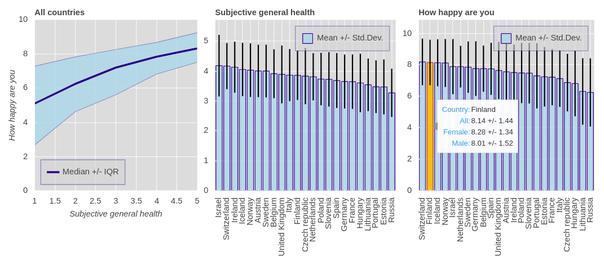
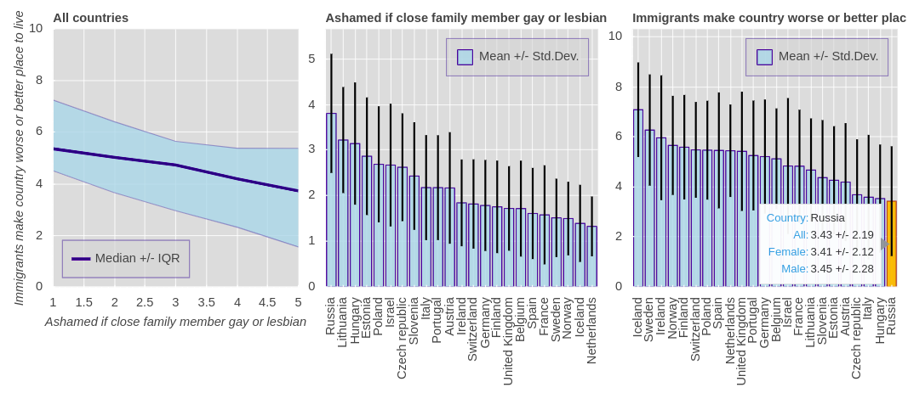
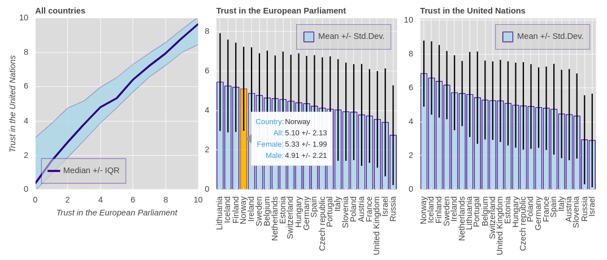
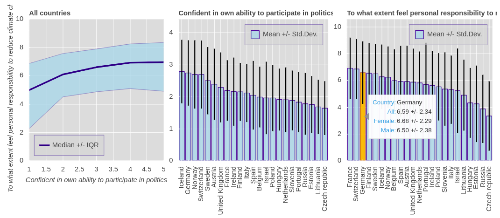
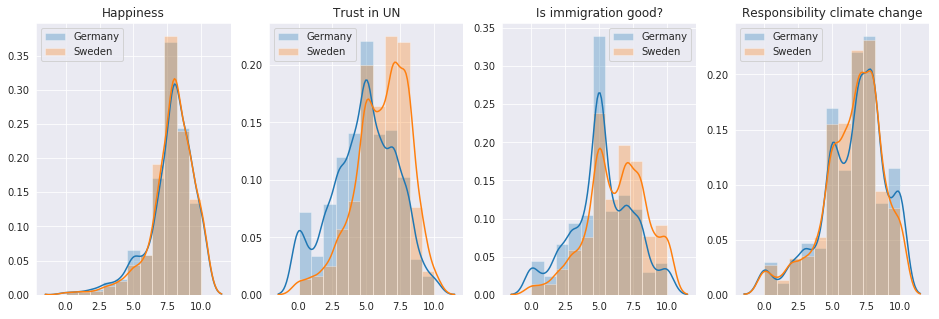
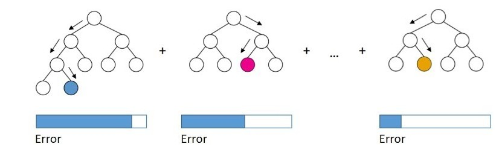

# Insights from the 8th European Social Survey

In this **full-stack data science project**, I will analyze the 8th European Social Survey. 

> *How do the citizens of European countries think about certain social issues? What about climate change, politics, immigration, individual well-being? How do people's opinions and beliefs differ within a country or among the countries?*

I attempt to answer these question here. After a contextual introduction, we will start with **data selection and cleaning**, followed by interactive **visualization and exploration**. In the second half of the project, we will gain deeper insights by employing **statistical inference** and **machine learning** methods and discuss their validity and interpretability.

If you come from a non-technical background, you may want to jump to the next section in which I provide a [non-technical short summary](#sum). If you are comfortable with reading Python code and have some basic knowledge of statistics and machine learning, better have a look at the whole project, which is contained in this [Jupyter notebook](./insights-from-the-european-social-survey-8.ipynb). The interactive visualization uses Java Script which cannot be rendered here on GitHub - please view the notebook [here on Jupyter's nbviewer](https://nbviewer.jupyter.org/github/Pascal-Bliem/european-social-survey/blob/master/insights-from-the-european-social-survey-8.ipynb). 

In case this link does not work, please go on [nbviewer.jupyter.org](https://nbviewer.jupyter.org/) and paste the URL  
https://github.com/Pascal-Bliem/european-social-survey/blob/master/insights-from-the-european-social-survey-8.ipynb  
into the search bar.

Thanks for your interest in the project, I hope you will find it interesting. If you have any questions, please feel free to message me.

## Non-technical short summary <a id="sum" ><a/>

This short summary is aimed at people who are interested in this cool project but are not so comfortable with reading code or discussing math details. I'll try to focus more on the interesting results, less on the technical details, and hopefully inspire you to look for what interests you in this survey. 

We'll cover the following parts here:
1. [Introduction](#introduction) - what is this project all about?
2. [Data selection and cleaning](#data) - bringing the data in a useful shape
3. [Exploration and visualization](#viz) - taking a look a the data's story
4. [Statistical tests](#stats) - how significant are the effects we observe?
5. [Predicting survey answers](#ml) - using algorithms to understand people
6. [Conclusion](#conclusion)

### Introduction 
Europe is a vast and diverse continent and its population is a fascinating subject for sociological studies. The [European Social Survey](https://www.europeansocialsurvey.org/) provides great data sets for exactly that purpose. According to their own description, *"The European Social Survey (ESS) is an academically driven cross-national survey that has been conducted across Europe since its establishment in 2001. Every two years, face-to-face interviews are conducted with newly selected, cross-sectional samples. The survey measures the attitudes, beliefs and behaviour patterns of diverse populations in more than thirty nations."*. This data set contains the results of the 8th round of the ESS surveyed in 2016/17.

We may wonder, how do the citizens of European countries think about certain social issues?  What about climate change, politics, immigration, individual well-being? How do people's opinions and beliefs differ within a country or among the countries? I'm personally interested in these questions because I have been roaming around Asia for a long time but soon I may return to Europe. I've been quite disconnected from my home country but I heard the horror stories about anti-democratic political parties on the rise, anti-immigration tendencies, people denying climate change, and so on. One can easily get the impression from the media that many people are unhappy or dissatisfied about a lot of things. That's scary enough to make me want to check some actual numbers instead of listening to all the flashy headlines. Follow along while I dig into this data set to see what I should expect when I get back home to Europe soon. Oh, one more thing before we start: for whatever reason Israel took part in this survey; last time I checked Israel was not in Europe, but hey, welcome on board friends.

### Data selection and cleaning 
Before we can do any meaningful analysis, the data has to be in a tidy and organized shape. With such a big survey, however, it unfortunately does not come like this naturally. 44387 people took part in this survey. When dealing with a lot of numbers, it can be too easy to forget what is actually behind them - so at this point we should remind ourselves that each of these rows corresponds to a real human being who took the time for this survey. We should be grateful towards these people and appreciate their contribution to our scientific understanding. But now back to the data: Real data can be dirty! What does that mean in this example? 
 

  

<em>Data cleaning</em> 

The answers to the survey questions are called **variables** or **features** in this context. These 534 variables per person are grouped in topics such as media and social trust, politics, subjective well-being, social issues, climate change etc. which contain important information for us, but also administrative variables (such as interview dates) and interview code variables, and country specific variables which do not contribute the information we are looking for, so we have to get rid of them first. We'll only keep the ones that answer questions like *"On a scale of 0 to 10, how much do you agree with..."* and a few others like, country, gender, and age.

Another point to consider is that the ordinal answers to questions are not all on the same scale (e.g. 1 to 5 vs. 0 to 10) and some of the scales seem to be in reverse order with respect to how the corresponding question was phrased. Sometimes it makes sense to vary scales in surveys if the social scientists from up to 30 different countries are interested in a specific degree of detail and maybe scales are reversed to avoid [leading questions](https://en.wikipedia.org/wiki/Leading_question) in the survey (questions which suggest a certain answer). Whatever the reason may be, it does not help our understanding; therefore, I re-reversed the respective scales. Please refer to the [survey documentation](./ESS8e02.1.pdf) for more details.

Of course, there are also invalid answers, e.g. when people refused to answer, they don't know, or the answer is missing for an unspecified reason. These invalid responses are encoded with a lot of different numbers and it is crucial to make sure they are identified correctly and do not accidentally end up in the analysis. Generally, there are a lot of different ways of how the question encoding was designed. This  may be the result of many different groups of people from different institutions and countries working on this survey. I'll spare you from the rest of the details here, but I hope I made clear that already a lot of time and effort has to go into data preparation before we can even start the analysis.

### Exploration and visualization 
Now that we got the data cleaned, we want to find out what story it tells. We want to see what people answered to all these questions, how these answers differ by country or gender, and how the answers to some questions correlate with the answers to other questions. Which country is the happiest? Who feels the most trust in politics, feels most responsible for climate change, and do  women and men have different opinions on it? The best way to explore such questions is to visualize them in an interactive way so that we can click around, select different variables, and graphically see how the responses differ between the countries. Unfortunately, GitHub can not render the figures in an interactive way so you'll either have to see them in the project notebook, or I'll just show you the static version here.

Before we dive into the plot's message, let me describe its composition. There are the following three sub-plots: The line graph on the left shows how one variable Y behaves as a function of another variable X (e.g. how healthy are people vs. how happy are people). Sorry, a tiny bit of statistics jargon here: I decided to take the [median](https://en.wikipedia.org/wiki/Median) as a central tendency and the interquartile range [(IQR)](https://en.wikipedia.org/wiki/Interquartile_range) (instead of [mean](https://en.wikipedia.org/wiki/Mean) and [standard deviation](https://en.wikipedia.org/wiki/Standard_deviation)) because some of the variables' distributions are quite [skewed](https://en.wikipedia.org/wiki/Skewness). The central and right sub-plots are bar charts that show the mean values (and the standard deviation as lines around the bar tops) for variables X and Y, respectively, for each country. The countries are sorted according to the mean value of the variable, the highest being on the left. Let's have a look at the first figure!

  

<em>Questions: "Subjective general health" vs. "How happy are you?"</em> 

As we can, unsurprisingly, see in the plots above that people who feel healthy are also happier. If you have a look at the plots on the right, you can see that Israel (very European) feels the healthiest and Switzerland, probably due to chocolate, feels the happiest. If you hover your mouse over the happiness bars you can see that, on average, the women in Finland are a bit happier than the men and that in Italy, it's the other way around. In the interactive version of the figure, we can filter the left plot by country and see that e.g. in Hungary very healthy people are a lot happier (almost 4 points) than very unhealthy people. In contrast, in Norway this difference is much smaller (only 2 points). Maybe that can give us a hint that Norway's healthcare is quite excellent.

When talking about such small differences in means, we should keep in mind that the spread of answers is quite large in comparison. We will dedicate another section to statistical significance and effect sizes later on. Let's have a look at how the Europeans think about immigration and sexual orientation based on their answers to the questions *"Do immigrants make the country a worse or better place to live?"* and *"Are you ashamed if a close family member is gay or lesbian?*. In the plot below we can se that people who are less comfortable with homosexuality are also less comfortable with immigrants (e.g. Russia, Hungary) and vice-versa (e.g. Iceland, Sweden).

  

<em>Questions: "Do immigrants make the country a worse or better place to live?" vs. "Are you ashamed if a close family member is gay or lesbian?"</em> 

What about trust in political international cooperation? Let's have a look at the answers to the questions *"Do you have trust in the European Parliament?"* and *"Do you have trust in the United Nations?"*. In the plots below we can see that people who have a high trust in the European parliament generally also have a high trust in the United Nations. Some countries (e.g. Iceland, Finland) seem to have higher trust in these institutions than other countries (e.g. Israel, Russia). I'm happy to see that Norway is among the countries which have a high trust in the EU parliament even though they're not a member of the EU.

  

<em>Questions: "Do you have trust in the European Parliament?" vs. "Do you have trust in the United Nations?"</em> 

Let's look at a last example on how people feel about their participation in politics and their responsibility for climate change based on the questions *"Are you confident in your own ability to participate in politics?"* and *"To what extent do you feel personal responsibility to reduce climate change?*. There is a small trend of people who are more confident in their political abilities also feeling more personal responsibility to reduce climate change. Some countries (e.g. Germany, Switzerland) are among the leaders in both categories.

  

<em>Questions: "Are you confident in your own ability to participate in politics?" vs. "To what extent do you feel personal responsibility to reduce climate change?"</em> 

Those were a few interesting insights from the ESS8 which I picked as examples. What else are you interested in? There is still so much information in this survey, please go ahead and play around with the plots in the project notebook to see what interesting insights you can uncover. In the next section we will use some statistics concepts to see if and how what we saw here is actually meaningful. 

## Statistical tests and effect sizes 
In the exploration above we have seen some interesting looking effects and some apparent differences between countries. Let's for example compare the two European countries I've lived in: Germany and Sweden. It looks like they are similarly happy but have different levels of trust in the UN, different opinions on Immigraton and on personal responsibility to fight climate change.

But how do we know that these differences are actually meaningful and did not just appeared by random chance? And even if we can be confident that an observed difference is probably not just due to random fluctuation, is its magnitude large enough to be meaningful at all? Let's visualize this dilemma by looking at how the answers are distributed in this example.

  

<em>These histograms are showing how frequent respondents from Germany and Sweden gave a certain answer to the questions listed in the plot titles. The X-axes show the answers ("on a scale from 0 to 10, how much...") and the Y-axes show the answers' frequency.</em> 

We can see that the distributions of answers are not exactly the same for respondents from Germany and Sweden but in some cases they look very similar. So how can we find out if there is a meaningful difference? To answer these questions, statistics uses methods called **null hypothesis significance testing** and **effect sizes**. I go into a fair amount of detail in describing the theoretical background of these methods in the project notebook, but I will not go into any detail here because I think it may make you dizzy if you have no statistics background. Instead, let me just summarize the basic idea: We compare the data we collected to the distribution we would expect if there was no real difference (that's the null hypothesis). If the data (the difference between the two groups) seems very surprising under this assumption, we conclude that there probably is an actual difference. The test I used in this case is called a [t-test](https://en.wikipedia.org/wiki/Welch%27s_t-test) and from its result, we can also calculate a standardized effect size. The effect size we use here is called [Cohen's *d*](https://en.wikipedia.org/wiki/Effect_size#Cohen's_d) and it represents a difference in means between the two groups divided by the standard deviation of the data. As a rule of thumb, 0.2 is considered small, 0.5 medium, and 0.8 large of an effect.

Now how about the apparent differences in the example? After performing the tests, we can say that the Germans and Swedes who responded in this survey show no statistically significant difference in their happiness or their personal responsibility to reduce climate change. The Swedes, however, think more than the Germans that immigrants make the country a better place to live (*d* = 0.47, a small to medium size effect) and they also have more trust in the United Nations (*d* = 0.61, a medium size effect). We can conduct these tests to investigate the differences between any pair of countries for any survey question. Another example I tested: What do Italians and French think about the question *"How important is it to be successful and that people recognize one's achievements?"* Turns out there is a huge effect of *d* = 1.44; looks like the Italian respondents here care a lot more about being successful and recognized by others than the French respondents.

If you're interested in any other question and country combination, please feel free to check out the test function in the project notebook yourself! In the next section we will try to build machine learning models to predict how people did respond to certain questions and try to explain these predictions to get a better understanding why people feel the way they do.

### Predicting answers with machine learning 
We have seen in the previous sections that people who answer some questions in a certain way also seem likely to answer other questions in a specific way. There seem to be certain types of personalities, attitudes, or opinions which can be observed among the respondents of the survey. Can we make use of these patterns to make a prediction of how people feel about something, based on the answers they have given? 

In this example, I want to see if I can predict **how happy** respondents rate themselves. To do so, I want to use machine learning algorithms. The main idea of machine learning is that computer algorithms and statistical models perform a task by recognizing patterns and inferring from these patterns, instead of using explicitly programmed instructions. In this example, I want to build models that can recognize what happy or sad people answered to the survey questions. Given the answers to all other questions, it should then be able to predict how happy or sad a person rated themselves.

  

<em>How happy are you?</em> 

Before programming the models there is, again, quite a bit of data preparation to do. In particular, I want to reduce the amount of variables (usually called features in machine learning) to only focus on the informative ones, deal with outliers, and transform the data so that all variables are on a similar scale. I want to compare two kinds of models here, a linear regression and a gradient-boosted decision tree ensemble. 

Yeah, very scary names, I know; but no worries, I'll try to give an easy explanation. Do you remember the equation for a straight line, *y = a * x + b*, from highschool math? That's basically the idea of a linear regression. The happiness we want to predict is the *y*-value an we do not only have one variable *x* and coefficient *a*, but many - those are the variables/features and their coefficients. The algorithm will find the coefficients that will result in the best predictions of happiness for all the known data we have, and we can then use the equation to predict new *y*-values.

Decision trees work quite differently. Based on the known data, they split the range of one variable and predict a value for all data points in one part of the range and another value for data points in the other part of the range. They can perform many splits (like the branches of a tree, ending in leaves) on different variables to get more accurate predictions. But only one decision tree will usually not be satisfactory; instead, one can use many subsequent trees of which each one tries to correct the error of its predecessor. That's the idea of boosting.

  

<em>The idea of boosted decision trees. <a href="https://sefiks.com/2018/10/04/a-step-by-step-gradient-boosting-decision-tree-example/">(image source)</a></em> 

